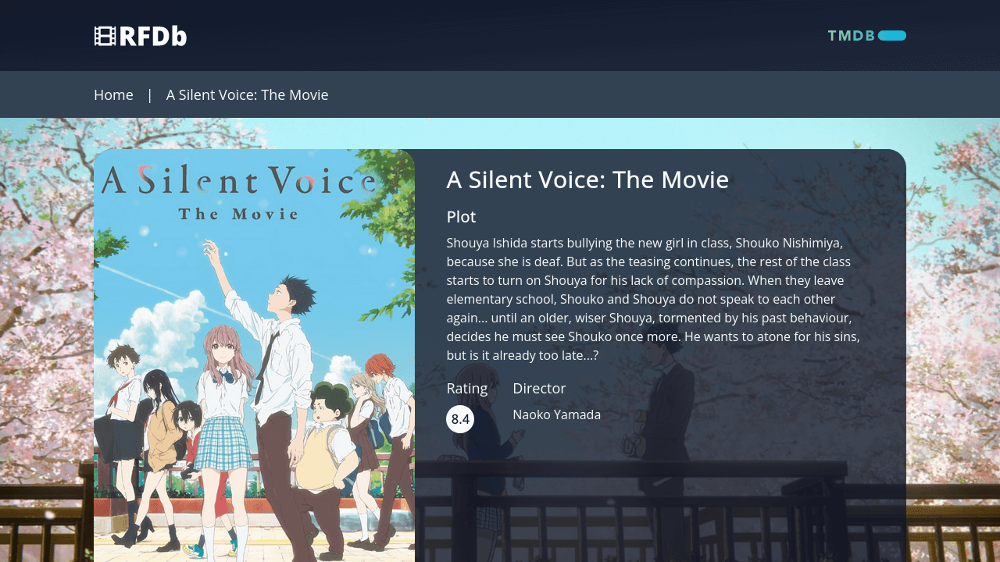

# React Film Database

A fast and easy-to-use film database web application.

  
Table of Contents

  <ol>
    <li><a href="#description">Description</a></li>
    <li><a href="#live-demo">Live Demo</a></li>
    <li><a href="#built-with">Built With</a></li>
    <li><a href="#author">Author</a></li>
    <li><a href="#license">License</a></li>
    <li><a href="#acknowledgements">Acknowledgments</a></li>
  </ol>

## Description

React Film Database is a web application that allows users to browse and search for details about films. Load up the app to see a list of the most popular movies out right now, or use the searchbox to find your favorite film.

 

The project sources its data from The Movie Database API, and utilizes Netlify serverless functions to hide the api key in production.

## Live Demo

Preview the live demo: [https://rfdb.netlify.app/](https://rfdb.netlify.app/)

## Built with

- [TypeScript](https://www.typescriptlang.org/)
- [React](https://reactjs.org/)
- [Tailwind CSS](https://tailwindcss.com/)

## Author

**Jon Rutter**

- [GitHub Profile](https://www.github.com/rutterjt)
- [Email](mailto:contact@jonrutter.io)
- [Website](https://www.jonrutter.io)

## License

This project is licensed under the MIT License. See the LICENSE file for details.

## Acknowledgements

- This project uses the [TMDB API](https://www.themoviedb.org/?language=en-US) as a source for all movie data.
- Credit to [Thomas Weibenfalk](https://www.youtube.com/watch?v=6bxWgYfN4CQ) for creating the original design and idea for this project.
